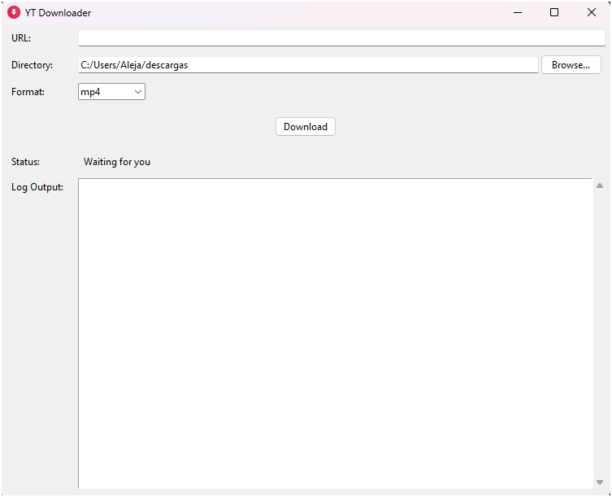

# YtDownloader

A desktop application with a graphical interface for easily and quickly downloading YouTube videos and audio.

 *(Application screenshot)*

## Features

- 🎥 Download videos in multiple formats (MP4, MKV, WEBM)
- 🎵 Extract audio in high-quality MP3 format (192kbps)
- 📁 Smart directory management with last used directory memory
- 📊 Detailed progress tracking with speed and ETA
- 📝 Comprehensive logging system
- 🔄 Playlist support with error handling
- 🎨 Modern and intuitive graphical interface
- 💾 Automatic settings persistence
- 🔍 URL validation feedback
- 📂 Quick access to download folder
- 🛠️ Robust error handling and recovery

## Requirements

- Python 3.6 or higher
- FFmpeg (required for format conversion)
- Required Python packages (install via pip):

  ```bash
  pip install -r requirements.txt
  ```

## Installation

1. Clone or download this repository
2. Install dependencies:

   ```bash
   pip install yt-dlp
   ```

3. Install FFmpeg:
   - Windows: Download from [ffmpeg.org](https://ffmpeg.org/download.html) and add to PATH
   - Linux: `sudo apt-get install ffmpeg`
   - macOS: `brew install ffmpeg`

## Usage

1. Run the application:

   ```bash
   python main.py
   ```

2. Paste a YouTube URL (single video or playlist)
3. Select desired format:
   - Video: MP4, MKV, or WEBM (up to 1080p)
   - Audio: MP3 (192kbps quality)
4. Choose destination directory (automatically remembered)
5. Click "Download" and monitor progress

## Features in Detail

### Video Downloads

- Supports multiple formats: MP4, MKV, WEBM
- Smart format selection with quality up to 1080p
- Automatic audio and video merging

### Audio Extraction

- High-quality MP3 conversion (192kbps)
- Metadata preservation
- Album art embedding when available

### User Experience

- Real-time download progress with speed and ETA
- Detailed logging with error reporting
- Last used directory remembering
- Direct access to download folder
- URL validation feedback

### Advanced Features

- Playlist support with individual file progress
- Robust error handling and recovery
- FFmpeg integration for reliable conversions
- Settings persistence across sessions

## Troubleshooting

- If FFmpeg is not installed, the application will show a warning at startup
- For download issues:
  - Verify your internet connection
  - Check URL validity
  - Ensure FFmpeg is properly installed
  - Review the log area for detailed error messages
- The application automatically creates download directories if they don't exist

## License

This project is available as open source.

## Contributing

- Report bugs
- Suggest new features
- Submit pull requests
- Improve documentation
