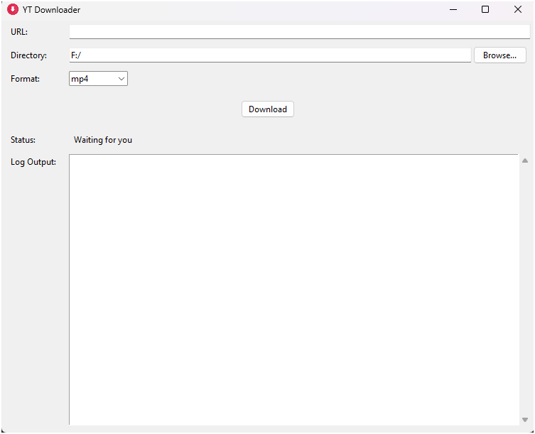

# YtDownloader

A modern, user-friendly desktop application for downloading YouTube videos and audio with a clean graphical interface. Built with Python and tkinter, it provides a seamless experience for downloading content in various formats.

 *(Application screenshot)*

## Key Features

- Download videos in multiple formats (MP4, MKV, WEBM)
- Extract high-quality audio (MP3 at 192kbps)
- Real-time progress tracking with speed and ETA
- Detailed logging system for troubleshooting
- Playlist support with error handling
- Modern, intuitive GUI with DPI awareness
- Automatic settings persistence
- Real-time URL validation
- One-click access to download folder

## Quick Start

1. **Prerequisites**
   - Python 3.6 or higher
   - FFmpeg (required for format conversion)

2. **Installation**

   ```bash
   # Clone the repository
   git clone https://github.com/your-username/YtDownloader.git
   cd YtDownloader

   # Install dependencies
   pip install -r requirements.txt

   # Install FFmpeg:
   # Windows: Download from ffmpeg.org and add to PATH
   # Linux: sudo apt-get install ffmpeg
   # macOS: brew install ffmpeg
   ```

3. **Run the Application**

   ```bash
   python main.py
   ```

## Usage

1. Launch the application
2. Paste a YouTube URL (video or playlist)
3. Choose your format:
   - **Video**: MP4, MKV, or WEBM (up to 1080p)
   - **Audio**: MP3 (192kbps)
4. Select destination folder
5. Click "Download" and track progress

## Technical Features

### Video Processing

- Smart format selection prioritizing quality up to 1080p
- Automatic audio-video stream merging
- Multiple container format support (MP4, MKV, WEBM)

### Audio Extraction

- High-quality MP3 conversion (192kbps)
- Metadata preservation
- Album art embedding (when available)

### User Experience

- Windows DPI awareness for crisp display
- Persistent settings across sessions
- Real-time URL validation
- Comprehensive error handling
- Detailed logging system

### Advanced Features

- Multi-threaded downloads
- Progress tracking per file
- FFmpeg integration
- Playlist support
- Automatic directory creation

## Troubleshooting

### Common Issues

1. **FFmpeg Missing**
   - Error: "FFmpeg/FFprobe not found in system PATH"
   - Solution: Install FFmpeg and ensure it's in your system PATH

2. **Download Fails**
   - Check internet connection
   - Verify URL is valid
   - Review log area for specific error messages
   - Ensure sufficient disk space

3. **Format Issues**
   - Verify FFmpeg installation
   - Check if video is available in selected format
   - Try alternative format if issues persist

## Contributing

We welcome contributions! Here's how you can help:

- Report bugs
- Suggest features
- Submit pull requests
- Improve documentation

## License

This project is open source and available under the MIT License.

## Acknowledgments

- [yt-dlp](https://github.com/yt-dlp/yt-dlp) for the core download functionality
- [FFmpeg](https://ffmpeg.org/) for media processing
- All contributors and users of this project
